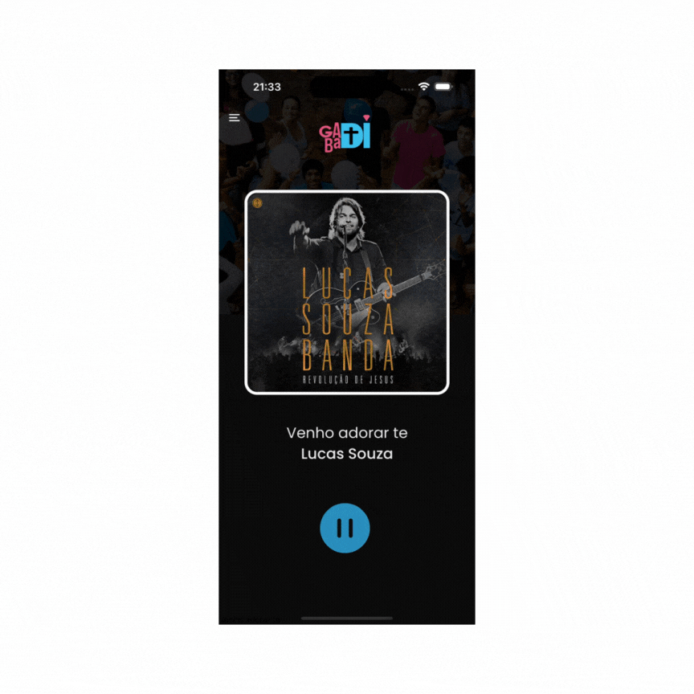

<h2 align="center"> App Gabadi </h2>


<h4 align="center"> App created to reproduce the web radio of a Christian church, making it possible to listen to it throughout Brazil. </h4>

<p align="center">
<br>
    
    
    
    
</p>

### [+] Description
App created to reproduce the web radio of a Christian church, making it possible to listen to it throughout Brazil. The app plays songs and radio programming integrated with Spotify to display images of the current artist playing at the moment. The names of the song and artist are retrieved through metadata from the server that generates the radio broadcast.

### [+] Links
Gabadi App is available for IOS and Android.
- Ios: <a href="https://apps.apple.com/br/app/gabadi/id6459659036">App Store</a>
- Android: <a href="https://play.google.com/store/apps/details?id=com.appgabadi">Google Play</a>

### [+] Preview

### [+] Instructions

- install dependencies: ```npm install```;
- Build application: open your android or ios simulator:
    - Android:
        - build the app locally or via eas (expo);
    - Ios:
        - build the app locally;
- run server expo: ```npx expo start --dev-client --tunnel```
- Open the app after installation
- Click in the server available
- Enjoy!

### [+] Find me on 
 <a href="mailto:lfelipelopesti@gmail.com" target="_blank"></a>

<a href="https://luizfelipelopes.github.io" target="_blank"></a>

<a href="https://www.linkedin.com/in/luizfelipelopes/" target="_blank"></a>